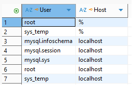
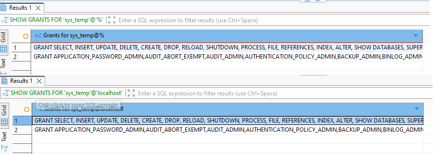
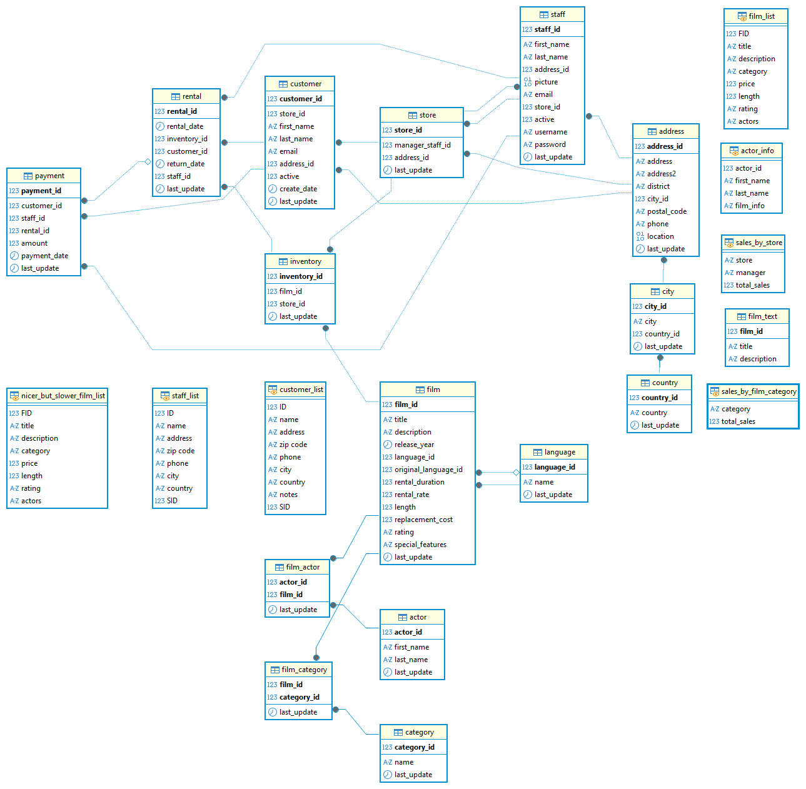
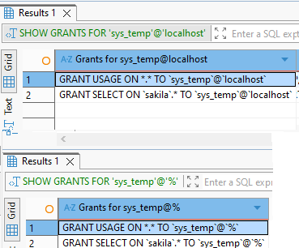

# Домашнее задание к занятию "Работа с данными (DDL/DML)" - Ткачев Сергей

## Задание 1. Поднимите чистый инстанс MySQL версии 8.0+. Можно использовать локальный сервер или контейнер Docker.
Работа с docker описана в файле docker-compose.yml

### Скрипты для управления БД:
- `init_db.bat` - Первоначальная настройка БД (для заданий 1.2-1.6)
- `restore_sakila.bat` - Восстановление БД sakila (для заданий 1.7+)
- `continue_db.bat` - Продолжение работы с БД без очистки
- `stop_db.bat` - Остановка БД

### Порядок выполнения заданий:

**Для заданий 1.2-1.6 (работа с пользователями):**
1. Запустите `init_db.bat` - получите чистую БД для создания пользователей

**Для заданий 1.7+ (работа с sakila):**
1. Запустите `restore_sakila.bat` - восстановите БД sakila

**Для повторного прохождения всех заданий:**
1. Запустите `init_db.bat` - полная очистка БД
2. Затем `restore_sakila.bat` - восстановление sakila

### 1.2 Создайте учётную запись sys_temp.
```sql
CREATE USER 'sys_temp'@'localhost' IDENTIFIED BY 'temp_password';
CREATE USER 'sys_temp'@'%' IDENTIFIED BY 'temp_password';
```

### 1.3. Выполните запрос на получение списка пользователей в базе данных. (скриншот)
```sql
SELECT User, Host FROM mysql.user;
```



### 1.4. Дайте все права для пользователя sys_temp.
```sql
GRANT ALL PRIVILEGES ON *.* TO 'sys_temp'@'%';
GRANT ALL PRIVILEGES ON *.* TO 'sys_temp'@'localhost';
FLUSH PRIVILEGES;
```

### 1.5. Выполните запрос на получение списка прав для пользователя sys_temp. (скриншот)
```sql
SHOW GRANTS FOR 'sys_temp'@'%';
SHOW GRANTS FOR 'sys_temp'@'localhost';
```



### 1.6. Переподключитесь к базе данных от имени sys_temp.
Для смены типа аутентификации с sha2 использованы запросы:
```sql
ALTER USER 'sys_temp'@'localhost' IDENTIFIED WITH mysql_native_password BY 'temp_password';
ALTER USER 'sys_temp'@'%' IDENTIFIED WITH mysql_native_password BY 'temp_password';
FLUSH PRIVILEGES;
```

### 1.6. По ссылке https://downloads.mysql.com/docs/sakila-db.zip скачайте дамп базы данных и восстановите.
**Примечание:** Для восстановления sakila используйте скрипт `restore_sakila.bat`.

Для ручного восстановления:
```bash
docker exec mysql_homework mysql -u root -prootpassword -e "source /tmp/sakila-schema.sql"
docker exec mysql_homework mysql -u root -prootpassword -e "source /tmp/sakila-data.sql"
```

### 1.7. При работе в IDE сформируйте ER-диаграмму получившейся базы данных. При работе в командной строке используйте команду для получения всех таблиц базы данных. (скриншот)
```sql
SHOW TABLES;
```



```
Tables_in_sakila
actor
actor_info
address
category
city
country
customer
customer_list
film
film_actor
film_category
film_list
film_text
inventory
language
nicer_but_slower_film_list
payment
rental
sales_by_film_category
sales_by_store
staff
staff_list
store
```


### Задание 2. Составьте таблицу, используя любой текстовый редактор или Excel, в которой должно быть два столбца: в первом должны быть названия таблиц восстановленной базы, во втором названия первичных ключей этих таблиц. 

```
| Название таблицы | Первичный ключ |
|------------------|----------------|
| actor | actor_id |
| address | address_id |
| category | category_id |
| city | city_id |
| country | country_id |
| customer | customer_id |
| film | film_id |
| film_actor | actor_id, film_id (составной ключ) |
| film_category | film_id, category_id (составной ключ) |
| film_text | film_id |
| inventory | inventory_id |
| language | language_id |
| payment | payment_id |
| rental | rental_id |
| staff | staff_id |
| store | store_id |
```

### Задание 3*
3.1. Уберите у пользователя sys_temp права на внесение, изменение и удаление данных из базы sakila.
```sql
REVOKE ALL PRIVILEGES ON *.* FROM 'sys_temp'@'localhost';
REVOKE ALL PRIVILEGES ON *.* FROM 'sys_temp'@'%';
GRANT SELECT ON sakila.* TO 'sys_temp'@'localhost';
GRANT SELECT ON sakila.* TO 'sys_temp'@'%';
FLUSH PRIVILEGES;
```


### 3.2. Выполните запрос на получение списка прав для пользователя sys_temp. (скриншот)
```sql
SHOW GRANTS FOR 'sys_temp'@'localhost';
SHOW GRANTS FOR 'sys_temp'@'%';
```


